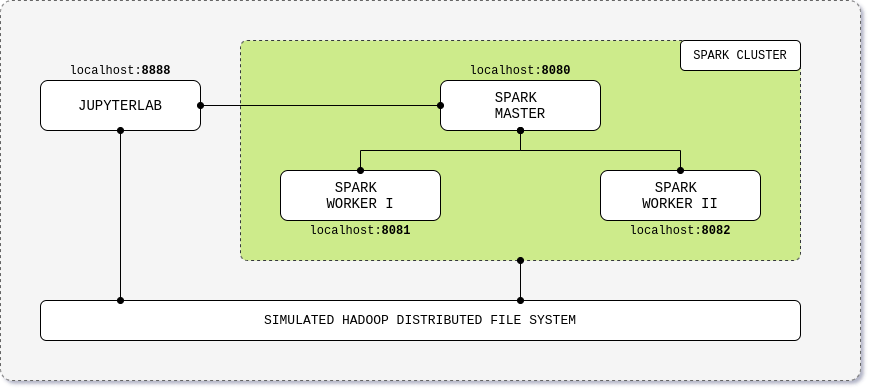

# Apache Spark Practice

A self-contained Apache Spark + JupyterLab lab stack, packaged as multi-arch Docker images for student use. Optional overlays add a Kafka broker (Spark Structured Streaming labs) and an HDFS cluster.

Originally based on [Standalone Cluster on Docker](https://github.com/cluster-apps-on-docker/spark-standalone-cluster-on-docker); rewritten for multi-arch publishing and a profile-driven Compose layout.



## What you get

| Service       | URL                                       | Purpose                                  |
|---------------|-------------------------------------------|------------------------------------------|
| JupyterLab    | http://localhost:8888                     | Notebooks, PySpark + Scala kernels       |
| Spark driver  | http://localhost:4040                     | Per-application UI                       |
| Spark master  | http://localhost:8080                     | Cluster overview                         |
| Spark workers | http://localhost:8081… (per replica)      | Worker UIs                               |

Optional overlays:

| Profile  | Adds                                                                           |
|----------|--------------------------------------------------------------------------------|
| `kafka`  | ZooKeeper, Kafka broker, Schema Registry — for Structured Streaming labs       |
| `hdfs`   | HDFS NameNode + DataNode — for distributed-storage labs                        |

## Quick start (students)

You only need Docker (with Compose v2) and `make`. No local build.

```bash
git clone https://github.com/janez87/spark-practice.git
cd spark-practice
make init        # one-time: creates .env from .env.example
make up          # docker pull + start the cluster
```

Open http://localhost:8888 — the notebooks under `notebooks/` are bind-mounted into the container, so your edits persist on your host machine.

To stop:
```bash
make down
```

For overlays:
```bash
make up-kafka    # core + kafka stack
make up-hdfs     # core + hdfs stack
```

See [`docs/quickstart.md`](docs/quickstart.md) for the full student walkthrough, [`docs/troubleshooting.md`](docs/troubleshooting.md) for common issues.

## Building from source (maintainers)

```bash
make build       # builds all images locally for your host architecture
make smoke       # runs tests/smoke/*.sh against the running stack
```

Multi-arch publishing happens in CI on tag push. To dry-run locally:

```bash
make buildx-init
make push PUSH_TAG=3.5.1-rc1   # builds + pushes amd64 and arm64
```

See [`docs/build-from-source.md`](docs/build-from-source.md) for details.

## Versions

| Component   | Version |
|-------------|---------|
| Spark       | 3.5.1   |
| Hadoop      | 3       |
| JupyterLab  | 4.1.5   |
| Scala       | 2.12.18 |
| Java        | 17 (Temurin) |
| Python      | 3 (system) |

Versions live in `scripts/version.sh` (and mirrored into `.make/version.mk` for the Makefile). Edit one place; everything else picks it up.

## Repository layout

See [`PLAN.md`](PLAN.md) for the full layout and the rationale behind each move. Top-level summary:

- `compose/` — one core file + three overlays (kafka / hdfs / dev).
- `images/` — one Dockerfile per published image.
- `notebooks/` — practice sessions PS00–PS03, bind-mounted into JupyterLab.
- `config/` — `hadoop.env`, `spark-defaults.conf`.
- `scripts/` — `version.sh`, `fetch-data.sh`, `smoke-test.sh`.
- `tests/smoke/` — one bash check per service.
- `.github/workflows/` — CI + multi-arch publish + release.

## Contributing

See [`CONTRIBUTING.md`](CONTRIBUTING.md) for how to propose changes and the tag → release flow. The full breaking-change record between this version and the previous lab stack lives in [`docs/upgrading.md`](docs/upgrading.md).

## License

MIT — see [`LICENSE`](LICENSE).
